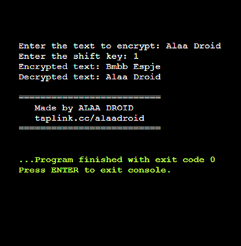
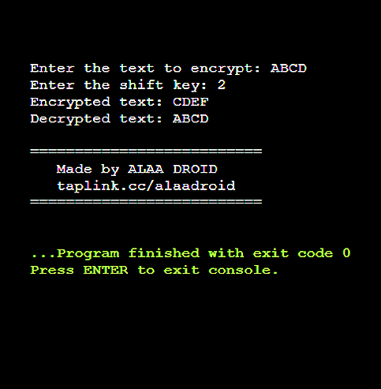

# Caesar Cipher Encryption & Decryption in C

This project implements the **Caesar Cipher**, a simple encryption technique where each letter in the plaintext is shifted by a fixed number of positions in the alphabet.

## Features
✅ Encrypts text using the Caesar Cipher algorithm.

✅ Decrypts text by reversing the encryption process.

✅ Supports both uppercase and lowercase letters.

✅ Ignores non-alphabetic characters (they remain unchanged).

✅ Written in pure **C** for efficiency and simplicity.


## Screenshots

|Main Menu|Test|
|---|---|
|||


## How It Works
1. The user enters the text to be encrypted.
2. The user provides a shift key (an integer).
3. The program applies the shift to encrypt the text.
4. The program then decrypts the text back to its original form.

## 📥 Cloning the Repository
To get started, clone this repository using Git:

```bash
git clone https://github.com/ALAADROID/CaesarCipher.git
cd CaesarCipher
```

## 🛠️ Compilation
To compile the program, use **GCC**:

```bash
gcc -o caesar_cipher main.c
```

## 🚀 Running the Program
After compiling, run the program using:

```bash
./caesar_cipher
```

## 📌 Notes
- Make sure you have **GCC** installed on your system.
- If you're on Windows, you may need to use **MinGW** or **WSL** to run the compiled program.


## 💻 Running the Program Locally
If you'd like to run the project locally, simply clone or download the repository, compile `main.c`, and execute the generated binary using any standard C compiler such as GCC.

Simply open the file in your preferred compiler, compile, and run the program as instructed. Enjoy exploring the Caesar Cipher encryption and decryption process!


## 📜 License
This project is open-source and free to use.

---
**Developed by [ALAADROID](https://github.com/ALAADROID)**
